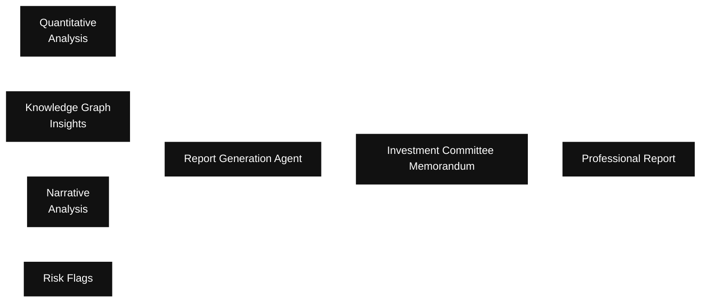

```mermaid
flowchart LR

    Q["Quantitative<br/>Analysis"]

    KG["Knowledge Graph<br/>Insights"]

    N["Narrative<br/>Analysis"]

    RF["Risk Flags"]

    AGENT["Report Generation Agent"]

    REPORT["Investment Committee Memorandum"]

    PDF["Professional Report"]

    Q --> AGENT
    KG --> AGENT
    N --> AGENT
    RF --> AGENT

    AGENT --> REPORT
    REPORT --> PDF

    classDef dark fill:#111111,stroke:#FFFFFF,color:#FFFFFF,stroke-width:2px;

    class Q,KG,N,RF,AGENT,REPORT,PDF dark;

    linkStyle default stroke:#FFFFFF,stroke-width:2px
```
