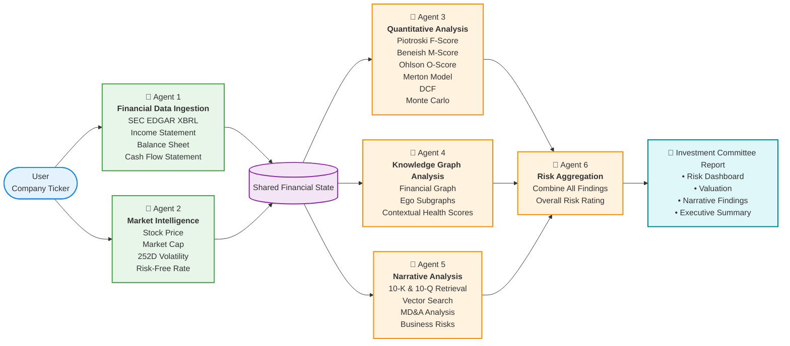

```mermaid
flowchart LR

    %% =========================
    %% INPUT
    %% =========================
    U([User<br/>Company Ticker])

    %% =========================
    %% DATA COLLECTION
    %% =========================
    A1["🤖 Agent 1<br/><b>Financial Data Ingestion</b><br/>SEC EDGAR XBRL<br/>Income Statement<br/>Balance Sheet<br/>Cash Flow Statement"]

    A2["🤖 Agent 2<br/><b>Market Intelligence</b><br/>Stock Price<br/>Market Cap<br/>252D Volatility<br/>Risk-Free Rate"]

    STATE[("Shared Financial State")]

    %% =========================
    %% ANALYSIS LAYER
    %% =========================
    Q["🤖 Agent 3<br/><b>Quantitative Analysis</b><br/>Piotroski F-Score<br/>Beneish M-Score<br/>Ohlson O-Score<br/>Merton Model<br/>DCF<br/>Monte Carlo"]

    KG["🤖 Agent 4<br/><b>Knowledge Graph Analysis</b><br/>Financial Graph<br/>Ego Subgraphs<br/>Contextual Health Scores"]

    N["🤖 Agent 5<br/><b>Narrative Analysis</b><br/>10-K & 10-Q Retrieval<br/>Vector Search<br/>MD&A Analysis<br/>Business Risks"]

    %% =========================
    %% AGGREGATION
    %% =========================
    R["🤖 Agent 6<br/><b>Risk Aggregation</b><br/>Combine All Findings<br/>Overall Risk Rating"]

    %% =========================
    %% OUTPUT
    %% =========================
    OUT["📄 Investment Committee Report<br/>• Risk Dashboard<br/>• Valuation<br/>• Narrative Findings<br/>• Executive Summary"]

    %% FLOW
    U --> A1
    U --> A2

    A1 --> STATE
    A2 --> STATE

    STATE --> Q
    STATE --> KG
    STATE --> N

    Q --> R
    KG --> R
    N --> R

    R --> OUT

    %% COLORS
    classDef input fill:#E3F2FD,stroke:#1E88E5,stroke-width:2px;
    classDef collect fill:#E8F5E9,stroke:#43A047,stroke-width:2px;
    classDef analysis fill:#FFF3E0,stroke:#FB8C00,stroke-width:2px;
    classDef state fill:#F3E5F5,stroke:#8E24AA,stroke-width:2px;
    classDef output fill:#E0F7FA,stroke:#00838F,stroke-width:2px;

    class U input;
    class A1,A2 collect;
    class STATE state;
    class Q,KG,N,R analysis;
    class OUT output;
```
