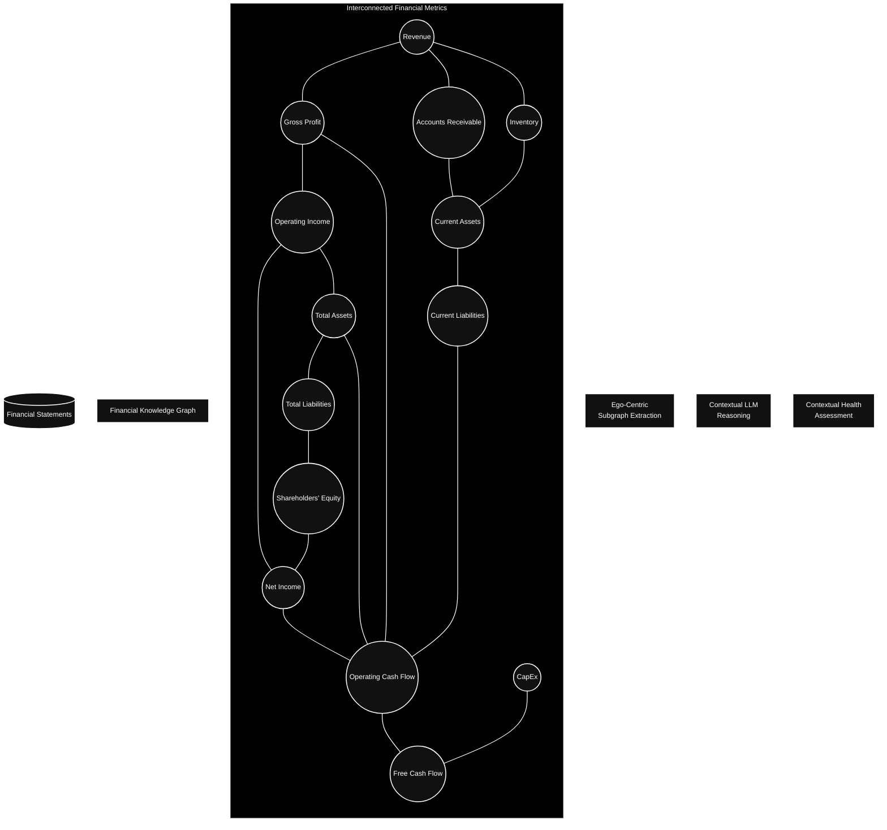

```mermaid
flowchart LR

    INPUT[(Financial Statements)]

    KG["Financial Knowledge Graph"]

    subgraph GRAPH["Interconnected Financial Metrics"]

        REV((Revenue))
        GP((Gross Profit))
        OI((Operating Income))
        NI((Net Income))

        CFO((Operating Cash Flow))
        FCF((Free Cash Flow))

        CA((Current Assets))
        CL((Current Liabilities))

        TA((Total Assets))
        TL((Total Liabilities))

        EQ((Shareholders' Equity))

        AR((Accounts Receivable))
        INV((Inventory))
        CAPEX((CapEx))

        REV --- GP
        GP --- OI
        OI --- NI

        REV --- AR
        REV --- INV

        NI --- CFO
        CFO --- FCF
        CAPEX --- FCF

        TA --- TL
        TL --- EQ
        TA --- CFO

        CA --- CL
        CL --- CFO

        AR --- CA
        INV --- CA

        EQ --- NI
        GP --- CFO
        OI --- TA

    end

    SUB["Ego-Centric<br/>Subgraph Extraction"]

    LLM["Contextual LLM<br/>Reasoning"]

    SCORE["Contextual Health<br/>Assessment"]

    INPUT --> KG
    KG --> GRAPH
    GRAPH --> SUB
    SUB --> LLM
    LLM --> SCORE

    classDef dark fill:#111111,stroke:#FFFFFF,color:#FFFFFF,stroke-width:2px;

    class INPUT,KG,SUB,LLM,SCORE dark;
    class REV,GP,OI,NI,CFO,FCF,CA,CL,TA,TL,EQ,AR,INV,CAPEX dark;

    style GRAPH fill:#000000,stroke:#666666,color:#FFFFFF

    linkStyle default stroke:#FFFFFF,stroke-width:1.6px
```
