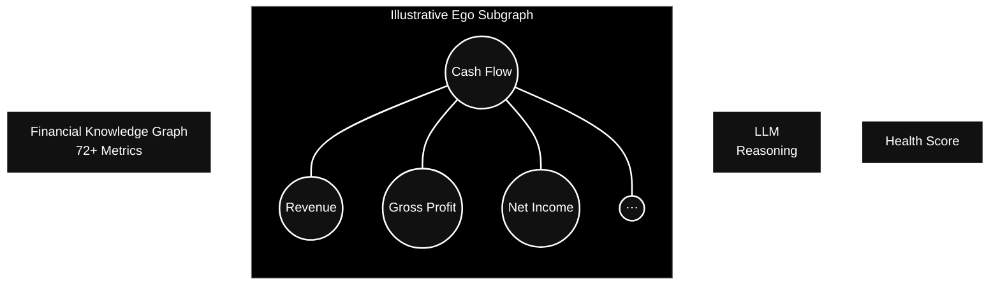

```mermaid
flowchart LR

    KG["Financial Knowledge Graph<br/>72+ Metrics"]

    subgraph SG["Illustrative Ego Subgraph"]

        REV((Revenue))
        GP((Gross Profit))
        CFO((Cash Flow))
        NI((Net Income))
        MORE((⋯))

        CFO --- REV
        CFO --- GP
        CFO --- NI
        CFO --- MORE

    end

    AI["LLM<br/>Reasoning"]

    SCORE["Health Score"]

    KG --> SG
    SG --> AI
    AI --> SCORE

    classDef dark fill:#111111,stroke:#FFFFFF,color:#FFFFFF,stroke-width:2px;

    class KG,AI,SCORE,REV,GP,CFO,NI,MORE dark;

    style SG fill:#000000,stroke:#666666,color:#FFFFFF

    linkStyle default stroke:#FFFFFF,stroke-width:2px
```
