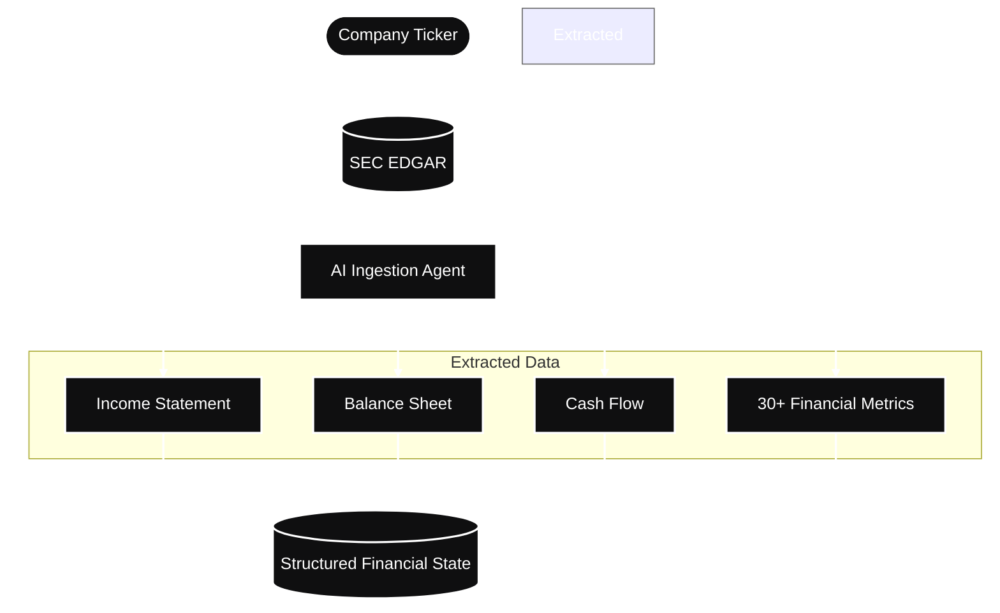

```mermaid
flowchart TB

    TICKER([Company Ticker])

    SEC[(SEC EDGAR)]

    AGENT["AI Ingestion Agent"]

    OUTPUT[(Structured Financial State)]

    TICKER --> SEC
    SEC --> AGENT
    AGENT --> OUTPUT

    subgraph Extracted Data
        IS[Income Statement]
        BS[Balance Sheet]
        CF[Cash Flow]
        METRICS[30+ Financial Metrics]
    end

    AGENT --> IS
    AGENT --> BS
    AGENT --> CF
    AGENT --> METRICS

    IS --> OUTPUT
    BS --> OUTPUT
    CF --> OUTPUT
    METRICS --> OUTPUT

    classDef dark fill:#0F0F10,stroke:#FFFFFF,color:#FFFFFF,stroke-width:2px;

    class TICKER,SEC,AGENT,OUTPUT,IS,BS,CF,METRICS dark;

    style Extracted Data fill:#000000,stroke:#666666,color:#FFFFFF

    linkStyle default stroke:#FFFFFF,stroke-width:2px
```
