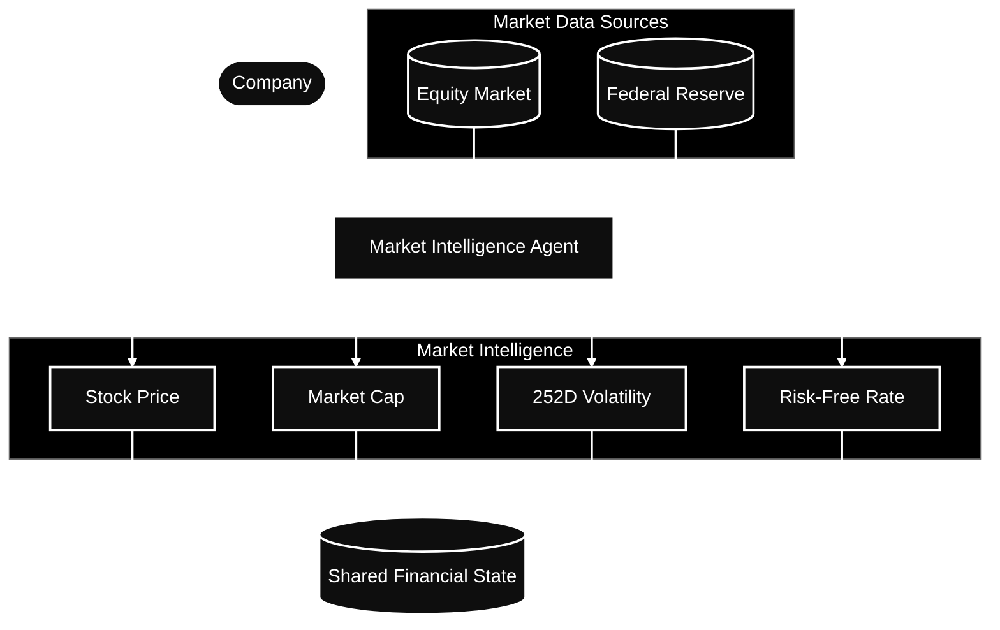

```mermaid
flowchart TB

    TICKER([Company])

    subgraph SOURCES["Market Data Sources"]

        PRICE[(Equity Market)]

        FRED[(Federal Reserve)]

    end

    AGENT["Market Intelligence Agent"]

    subgraph FEATURES["Market Intelligence"]

        P["Stock Price"]

        M["Market Cap"]

        V["252D Volatility"]

        R["Risk-Free Rate"]

    end

    OUTPUT[(Shared Financial State)]

    TICKER --> AGENT

    PRICE --> AGENT
    FRED --> AGENT

    AGENT --> P
    AGENT --> M
    AGENT --> V
    AGENT --> R

    P --> OUTPUT
    M --> OUTPUT
    V --> OUTPUT
    R --> OUTPUT

    classDef dark fill:#0E0E0E,stroke:#FFFFFF,color:#FFFFFF,stroke-width:2px;

    class TICKER,PRICE,FRED,AGENT,P,M,V,R,OUTPUT dark;

    style SOURCES fill:#000000,stroke:#666666,color:#FFFFFF

    style FEATURES fill:#000000,stroke:#666666,color:#FFFFFF

    linkStyle default stroke:#FFFFFF,stroke-width:2px
```
