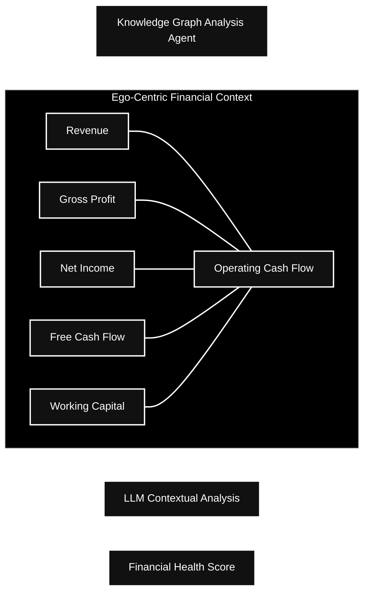

```mermaid
flowchart TB

    AGENT["Knowledge Graph Analysis Agent"]

    subgraph EGO["Ego-Centric Financial Context"]

        CENTER["Operating Cash Flow"]

        REV["Revenue"]
        GP["Gross Profit"]
        NI["Net Income"]
        FCF["Free Cash Flow"]
        WC["Working Capital"]

        REV --- CENTER
        GP --- CENTER
        NI --- CENTER
        FCF --- CENTER
        WC --- CENTER

    end

    AI["LLM Contextual Analysis"]

    SCORE["Financial Health Score"]

    AGENT --> EGO
    EGO --> AI
    AI --> SCORE

    classDef dark fill:#111111,stroke:#FFFFFF,color:#FFFFFF,stroke-width:2px;

    class AGENT,CENTER,REV,GP,NI,FCF,WC,AI,SCORE dark;

    style EGO fill:#000000,stroke:#666666,color:#FFFFFF

    linkStyle default stroke:#FFFFFF,stroke-width:2px
```
