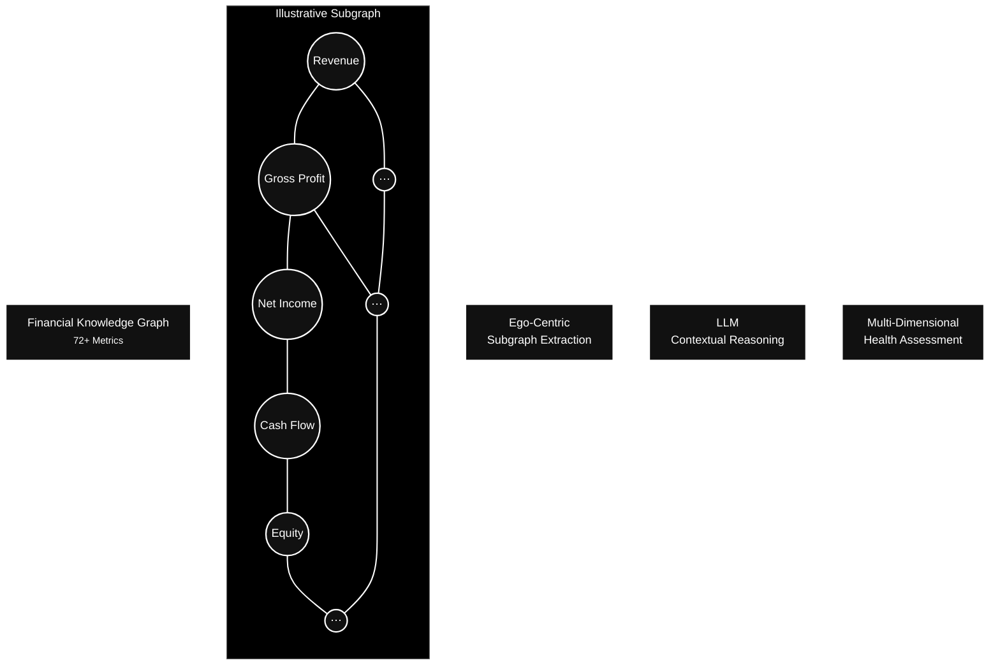

```mermaid
flowchart LR

    KG["Financial Knowledge Graph<br/><small>72+ Metrics</small>"]

    subgraph SG["Illustrative Subgraph"]

        REV((Revenue))
        GP((Gross Profit))
        NI((Net Income))
        CFO((Cash Flow))
        EQ((Equity))

        MORE1((⋯))
        MORE2((⋯))
        MORE3((⋯))

        REV --- GP
        GP --- NI
        NI --- CFO
        CFO --- EQ

        REV --- MORE1
        GP --- MORE2
        EQ --- MORE3

        MORE1 --- MORE2
        MORE2 --- MORE3

    end

    EGO["Ego-Centric<br/>Subgraph Extraction"]

    LLM["LLM<br/>Contextual Reasoning"]

    SCORE["Multi-Dimensional<br/>Health Assessment"]

    KG --> SG
    SG --> EGO
    EGO --> LLM
    LLM --> SCORE

    classDef dark fill:#111111,stroke:#FFFFFF,color:#FFFFFF,stroke-width:2px;

    class KG,EGO,LLM,SCORE,REV,GP,NI,CFO,EQ,MORE1,MORE2,MORE3 dark;

    style SG fill:#000000,stroke:#666666,color:#FFFFFF

    linkStyle default stroke:#FFFFFF,stroke-width:1.8px
```
