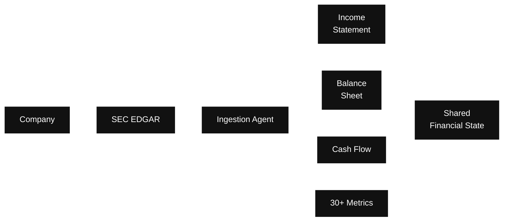

```mermaid
flowchart LR

    COMPANY["Company"]

    EDGAR["SEC EDGAR"]

    INGEST["Ingestion Agent"]

    IS["Income<br/>Statement"]

    BS["Balance<br/>Sheet"]

    CF["Cash Flow"]

    METRICS["30+ Metrics"]

    STATE["Shared<br/>Financial State"]

    COMPANY --> EDGAR
    EDGAR --> INGEST

    INGEST --> IS
    INGEST --> BS
    INGEST --> CF
    INGEST --> METRICS

    IS --> STATE
    BS --> STATE
    CF --> STATE
    METRICS --> STATE

    classDef dark fill:#111111,stroke:#FFFFFF,color:#FFFFFF,stroke-width:2px;

    class COMPANY,EDGAR,INGEST,IS,BS,CF,METRICS,STATE dark;

    linkStyle default stroke:#FFFFFF,stroke-width:2px
```
