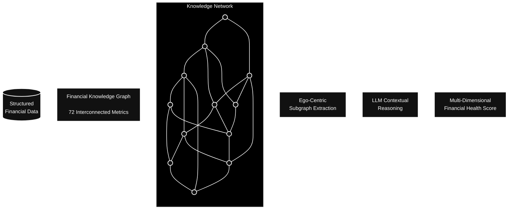

```mermaid
flowchart LR

    INPUT[(Structured<br/>Financial Data)]

    GRAPH["Financial Knowledge Graph<br/><br/>72 Interconnected Metrics"]

    subgraph NETWORK["Knowledge Network"]

        N1(( ))
        N2(( ))
        N3(( ))
        N4(( ))
        N5(( ))
        N6(( ))
        N7(( ))
        N8(( ))
        N9(( ))
        N10(( ))
        N11(( ))
        N12(( ))

        N1 --- N2
        N1 --- N5
        N2 --- N3
        N2 --- N6
        N3 --- N4
        N3 --- N7
        N4 --- N8
        N5 --- N6
        N5 --- N9
        N6 --- N7
        N6 --- N10
        N7 --- N8
        N7 --- N11
        N8 --- N12
        N9 --- N10
        N10 --- N11
        N11 --- N12
        N2 --- N9
        N4 --- N10
        N5 --- N11
        N3 --- N12

    end

    EGO["Ego-Centric<br/>Subgraph Extraction"]

    LLM["LLM Contextual<br/>Reasoning"]

    OUTPUT["Multi-Dimensional<br/>Financial Health Score"]

    INPUT --> GRAPH
    GRAPH --> NETWORK
    NETWORK --> EGO
    EGO --> LLM
    LLM --> OUTPUT

    classDef dark fill:#111111,stroke:#FFFFFF,color:#FFFFFF,stroke-width:2px;

    class INPUT,GRAPH,EGO,LLM,OUTPUT dark;
    class N1,N2,N3,N4,N5,N6,N7,N8,N9,N10,N11,N12 dark;

    style NETWORK fill:#000000,stroke:#666666,color:#FFFFFF

    linkStyle default stroke:#FFFFFF,stroke-width:1.6px
```
