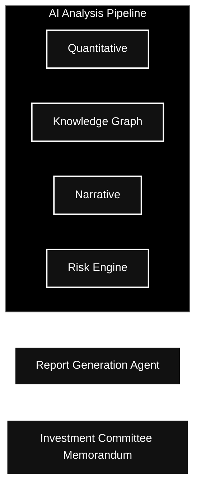

```mermaid
flowchart TB

    subgraph AI["AI Analysis Pipeline"]

        Q["Quantitative"]

        KG["Knowledge Graph"]

        N["Narrative"]

        R["Risk Engine"]

    end

    REPORT["Report Generation Agent"]

    DOC["Investment Committee Memorandum"]

    AI --> REPORT
    REPORT --> DOC

    classDef dark fill:#111111,stroke:#FFFFFF,color:#FFFFFF,stroke-width:2px;

    class Q,KG,N,R,REPORT,DOC dark;

    style AI fill:#000000,stroke:#666666,color:#FFFFFF

    linkStyle default stroke:#FFFFFF,stroke-width:2px
```
