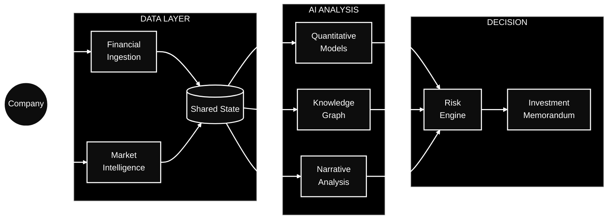

```mermaid
flowchart LR

%% =========================
%% INPUT
%% =========================

U(("Company"))

%% =========================
%% DATA LAYER
%% =========================

subgraph DATA["DATA LAYER"]

A1["Financial<br/>Ingestion"]

A2["Market<br/>Intelligence"]

S[(Shared State)]

end

%% =========================
%% AI LAYER
%% =========================

subgraph AI["AI ANALYSIS"]

Q["Quantitative<br/>Models"]

KG["Knowledge<br/>Graph"]

N["Narrative<br/>Analysis"]

end

%% =========================
%% DECISION
%% =========================

subgraph DECISION["DECISION"]

R["Risk<br/>Engine"]

REPORT["Investment<br/>Memorandum"]

end

%% FLOW

U --> A1
U --> A2

A1 --> S
A2 --> S

S --> Q
S --> KG
S --> N

Q --> R
KG --> R
N --> R

R --> REPORT

%% =========================
%% DARK THEME
%% =========================

classDef node fill:#0D0D0D,stroke:#FFFFFF,color:#FFFFFF,stroke-width:2px;

class U,A1,A2,S,Q,KG,N,R,REPORT node;

style DATA fill:#000000,stroke:#888888,color:#FFFFFF
style AI fill:#000000,stroke:#888888,color:#FFFFFF
style DECISION fill:#000000,stroke:#888888,color:#FFFFFF

linkStyle default stroke:#FFFFFF,stroke-width:2px
```
