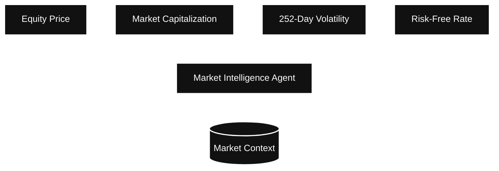

```mermaid
flowchart TB

    PRICE["Equity Price"]

    CAP["Market Capitalization"]

    VOL["252-Day Volatility"]

    RATE["Risk-Free Rate"]

    AGENT["Market Intelligence Agent"]

    OUTPUT[(Market Context)]

    PRICE --> AGENT
    CAP --> AGENT
    VOL --> AGENT
    RATE --> AGENT

    AGENT --> OUTPUT

    classDef dark fill:#111111,stroke:#FFFFFF,color:#FFFFFF,stroke-width:2px;

    class PRICE,CAP,VOL,RATE,AGENT,OUTPUT dark;

    linkStyle default stroke:#FFFFFF,stroke-width:2px
```
