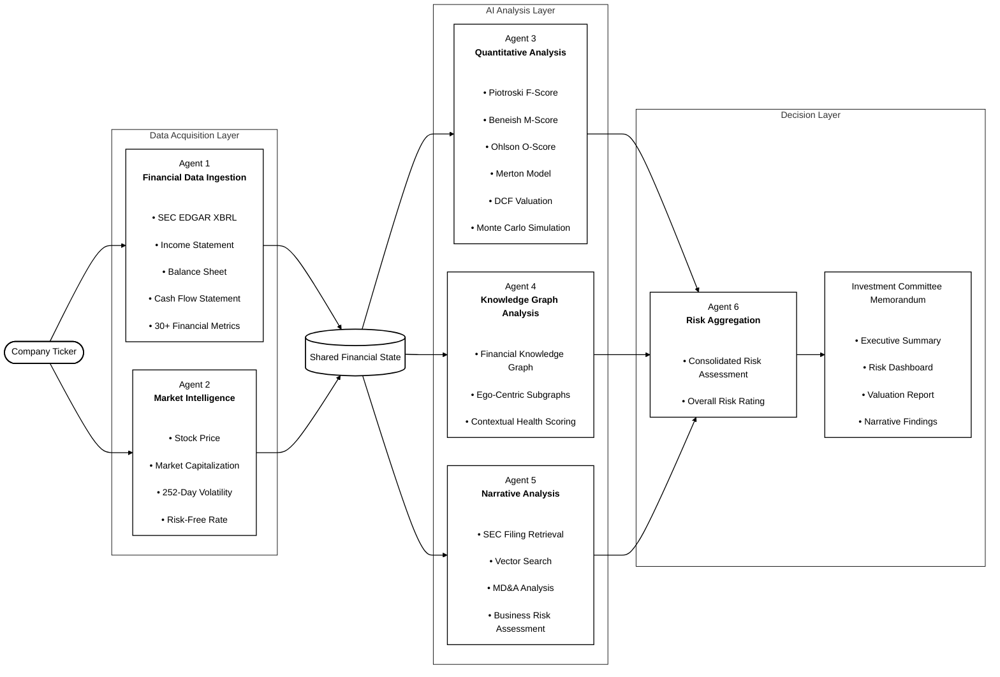

```mermaid
flowchart LR

%% =========================
%% INPUT
%% =========================
U([Company Ticker])

%% =========================
%% DATA ACQUISITION
%% =========================
subgraph L1["Data Acquisition Layer"]

A1["Agent 1<br/><b>Financial Data Ingestion</b><br/><br/>
• SEC EDGAR XBRL<br/>
• Income Statement<br/>
• Balance Sheet<br/>
• Cash Flow Statement<br/>
• 30+ Financial Metrics"]

A2["Agent 2<br/><b>Market Intelligence</b><br/><br/>
• Stock Price<br/>
• Market Capitalization<br/>
• 252-Day Volatility<br/>
• Risk-Free Rate"]

end

STATE[(Shared Financial State)]

%% =========================
%% ANALYSIS
%% =========================
subgraph L2["AI Analysis Layer"]

Q["Agent 3<br/><b>Quantitative Analysis</b><br/><br/>
• Piotroski F-Score<br/>
• Beneish M-Score<br/>
• Ohlson O-Score<br/>
• Merton Model<br/>
• DCF Valuation<br/>
• Monte Carlo Simulation"]

KG["Agent 4<br/><b>Knowledge Graph Analysis</b><br/><br/>
• Financial Knowledge Graph<br/>
• Ego-Centric Subgraphs<br/>
• Contextual Health Scoring"]

N["Agent 5<br/><b>Narrative Analysis</b><br/><br/>
• SEC Filing Retrieval<br/>
• Vector Search<br/>
• MD&A Analysis<br/>
• Business Risk Assessment"]

end

%% =========================
%% DECISION
%% =========================
subgraph L3["Decision Layer"]

R["Agent 6<br/><b>Risk Aggregation</b><br/><br/>
• Consolidated Risk Assessment<br/>
• Overall Risk Rating"]

OUT["Investment Committee Memorandum<br/><br/>
• Executive Summary<br/>
• Risk Dashboard<br/>
• Valuation Report<br/>
• Narrative Findings"]

end

%% FLOW
U --> A1
U --> A2

A1 --> STATE
A2 --> STATE

STATE --> Q
STATE --> KG
STATE --> N

Q --> R
KG --> R
N --> R

R --> OUT

%% =========================
%% PROFESSIONAL STYLING
%% =========================

classDef default fill:#ffffff,stroke:#000000,color:#000000,stroke-width:1.5px;

style U fill:#ffffff,stroke:#000000,stroke-width:2px

style STATE fill:#ffffff,stroke:#000000,stroke-width:2px

style L1 fill:#ffffff,stroke:#000000,stroke-width:1px
style L2 fill:#ffffff,stroke:#000000,stroke-width:1px
style L3 fill:#ffffff,stroke:#000000,stroke-width:1px

linkStyle default stroke:#000000,stroke-width:1.5px
```
