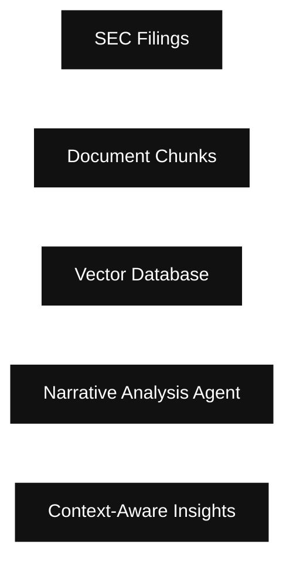

```mermaid
flowchart TB

    FILINGS["SEC Filings"]

    CHUNKS["Document Chunks"]

    VECTOR["Vector Database"]

    AGENT["Narrative Analysis Agent"]

    INSIGHTS["Context-Aware Insights"]

    FILINGS --> CHUNKS
    CHUNKS --> VECTOR
    VECTOR --> AGENT
    AGENT --> INSIGHTS

    classDef dark fill:#111111,stroke:#FFFFFF,color:#FFFFFF,stroke-width:2px;

    class FILINGS,CHUNKS,VECTOR,AGENT,INSIGHTS dark;

    linkStyle default stroke:#FFFFFF,stroke-width:2px
```
