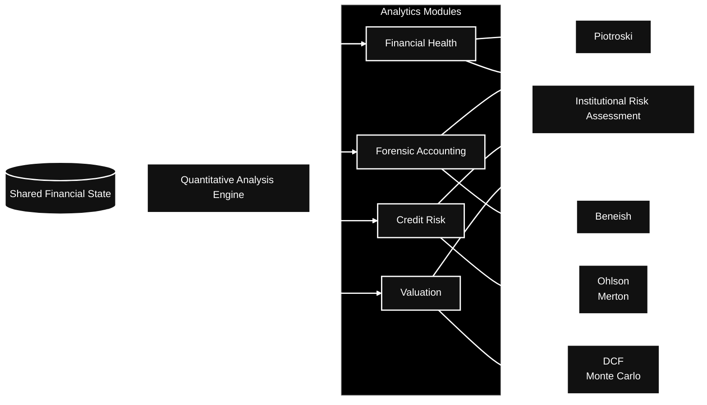

```mermaid
flowchart LR

    STATE[(Shared Financial State)]

    AGENT["Quantitative Analysis Engine"]

    subgraph ANALYTICS["Analytics Modules"]

        HEALTH["Financial Health"]

        FORENSICS["Forensic Accounting"]

        CREDIT["Credit Risk"]

        VAL["Valuation"]

    end

    OUTPUT["Institutional Risk Assessment"]

    STATE --> AGENT

    AGENT --> HEALTH
    AGENT --> FORENSICS
    AGENT --> CREDIT
    AGENT --> VAL

    HEALTH --- HEALTH_M["Piotroski"]

    FORENSICS --- FORENSICS_M["Beneish"]

    CREDIT --- CREDIT_M["Ohlson<br/>Merton"]

    VAL --- VAL_M["DCF<br/>Monte Carlo"]

    HEALTH --> OUTPUT
    FORENSICS --> OUTPUT
    CREDIT --> OUTPUT
    VAL --> OUTPUT

    classDef dark fill:#111111,stroke:#FFFFFF,color:#FFFFFF,stroke-width:2px;

    class STATE,AGENT,HEALTH,FORENSICS,CREDIT,VAL,OUTPUT,HEALTH_M,FORENSICS_M,CREDIT_M,VAL_M dark;

    style ANALYTICS fill:#000000,stroke:#666666,color:#FFFFFF

    linkStyle default stroke:#FFFFFF,stroke-width:2px
```
