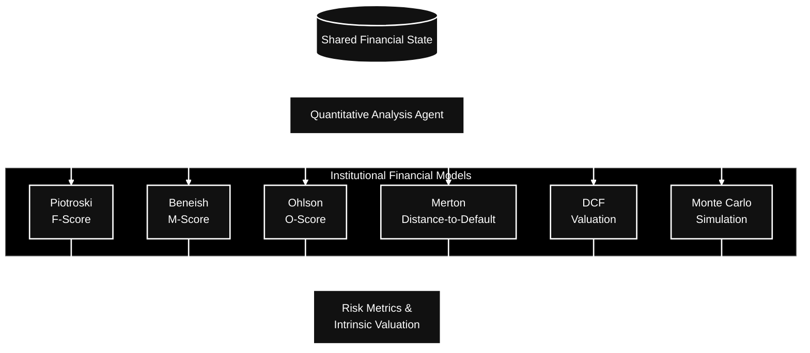

```mermaid
flowchart TB

    STATE[(Shared Financial State)]

    AGENT["Quantitative Analysis Agent"]

    subgraph MODELS["Institutional Financial Models"]

        F["Piotroski<br/>F-Score"]

        B["Beneish<br/>M-Score"]

        O["Ohlson<br/>O-Score"]

        M["Merton<br/>Distance-to-Default"]

        D["DCF<br/>Valuation"]

        MC["Monte Carlo<br/>Simulation"]

    end

    OUTPUT["Risk Metrics &<br/>Intrinsic Valuation"]

    STATE --> AGENT

    AGENT --> F
    AGENT --> B
    AGENT --> O
    AGENT --> M
    AGENT --> D
    AGENT --> MC

    F --> OUTPUT
    B --> OUTPUT
    O --> OUTPUT
    M --> OUTPUT
    D --> OUTPUT
    MC --> OUTPUT

    classDef dark fill:#111111,stroke:#FFFFFF,color:#FFFFFF,stroke-width:2px;

    class STATE,AGENT,F,B,O,M,D,MC,OUTPUT dark;

    style MODELS fill:#000000,stroke:#666666,color:#FFFFFF

    linkStyle default stroke:#FFFFFF,stroke-width:2px
```
